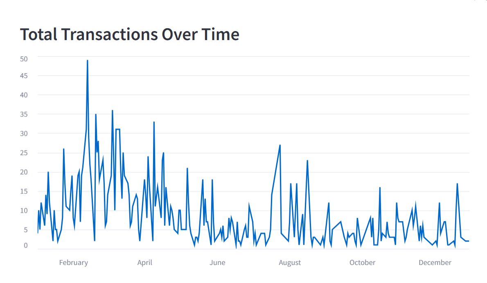
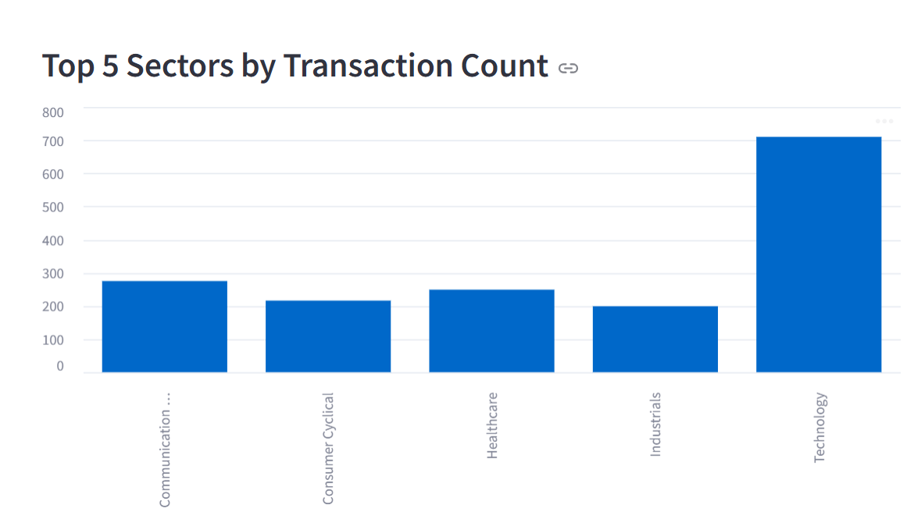
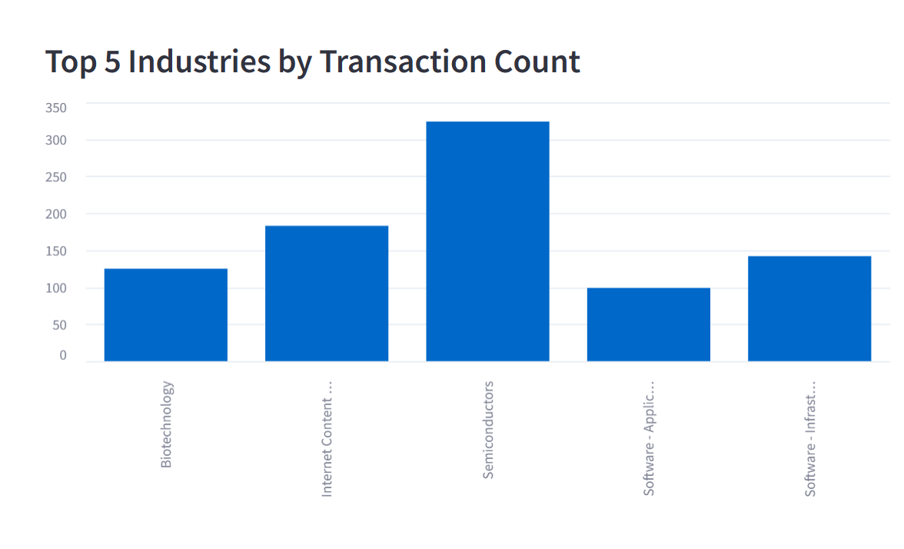

# Data Warehouse & Interactive Dashboard  

## Overview  
This project simulates a **Business Intelligence workflow**, starting from raw transactional data and moving through:  
- **ETL (Extract, Transform, Load) pipeline**  
- **Data Warehouse design (Star Schema)**  
- **Analytical queries in Python (pandas)**  
- **Data visualization with Matplotlib**  
- **Stock market data retrieval with yfinance**  
- **Fundamental analysis using key financial ratios (Profit Margin, P/E Ratio)**
- **Interactive dashboard with Streamlit**

The goal was to transform raw data into actionable insights, combining **Business Intelligence techniques** with **real-world financial analysis**.  

---

##  Features  
- Data **cleaning** and preprocessing (handling missing values, formatting, consistency checks, and outlier filtering).   
- Construction of a **Star Schema** with fact and dimension tables.  
- Analytical queries in Python (pandas) to answer Business Intelligence questions.  
- Retrieved **real stock market data** using yfinance and performed advanced financial analysis.  
- Created multiple **visualizations** (line charts, bar charts, scatter plots, multi-subplots, time series) with **Matplotlib** to compare stock performance, market capitalization, and profitability across sector and industry peers.  
- Conducted **fundamental analysis** using financial ratios such as Profit Margin and P/E Ratio, with comparisons at sector, industry, and national level.  
- Developed an interactive dashboard with **Streamlit** to:  
  - Filter transactions by date range  
  - View transactions over time  
  - Explore top traded symbols, sectors, and industries  


---

## Tech Stack  
- **Programming Languages**: Python  
- **Libraries & Tools**: pandas, numpy, matplotlib, yfinance, Streamlit  
- **Data Warehousing**: Star Schema modeling (fact & dimension tables)  
- **Data Analysis**: statistical analysis, outlier detection, financial ratios (Profit Margin, P/E)  
- **Visualization**: Matplotlib (charts, scatter plots, subplots), Streamlit (interactive dashboard)  


---

## Example Dashboard  

### Total Transactions Over Time  
  

### Top 5 Sectors by Transaction Count  
  

### Top 5 Industries by Transaction Count  
  

---


## Project Structure  

The project is organized as follows:

```plaintext
app.py                           # Streamlit dashboard (interactive visualization)  
Homework_Calcagno_Francesca.ipynb # Stock market analysis (yfinance, ratios, visualizations)  
Homework3_Calcagno_Francesca.ipynb # ETL pipeline, Star Schema, Fact/Dimension tables, BI-style queries  
account-statement-1-1-2024-12-31-2024.csv # Raw transactions dataset  
all.csv                          # Supporting dataset  
country.csv                      # Country information dataset  
final_joined_dataset.csv         # Pre-processed dataset (used by Streamlit app)  
output.csv                       # Raw dataset used in notebooks  
symbols.csv                      # Symbols dataset  
Symbols_info_modified.csv        # Processed dataset with company/sector info  
star_schema.pdf                  # Star Schema diagram of the Data Warehouse  
REPORT_FRANCESCA_CALCAGNO.pdf    # Full academic project report  
requirements.txt                 # Project dependencies (pandas, numpy, matplotlib, yfinance, streamlit, jupyter)  

images/                          # Screenshots for README  
  ├── transactions_over_time.png  
  ├── top_sectors.png  
  └── top_industries.png  

README.md                        # Project description
``` 


## How to Run
1. Clone the repository:  
   ```bash
   git clone https://github.com/Francesca-Calcagno/data-warehouse-dashboard.git
   cd data-warehouse-dashboard
2. Create a virtual environment
   ```
   python -m venv venv
4. Install dependencies:
    ```
   pip install -r requirements.txt
6. Run the Streamlit dashboard:
    ```
   streamlit run app.py

## Author  
**Francesca Calcagno**  
Master’s Student in Data Science @ University of Catania  
[LinkedIn](https://www.linkedin.com/in/francesca-calcagno-9554a5381/)
[GitHub](https://github.com/Francesca-Calcagno) 


 
